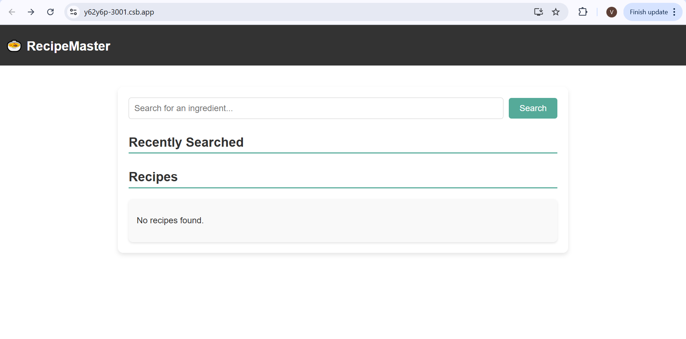
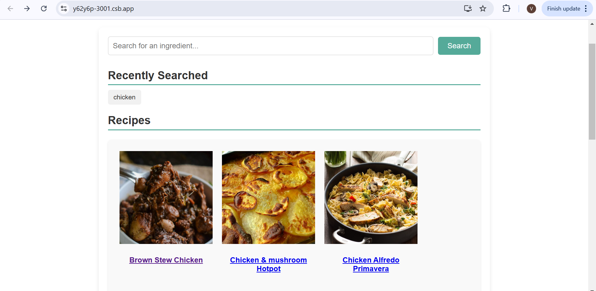
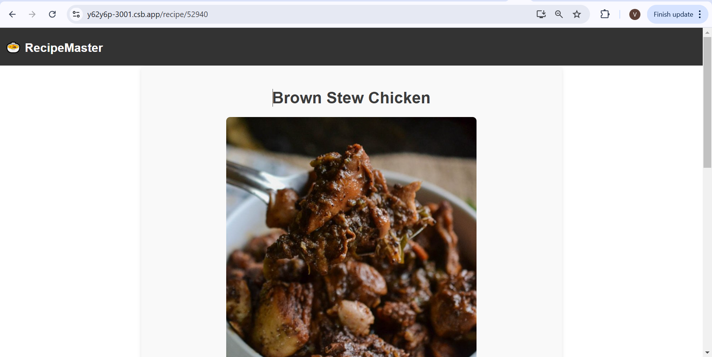
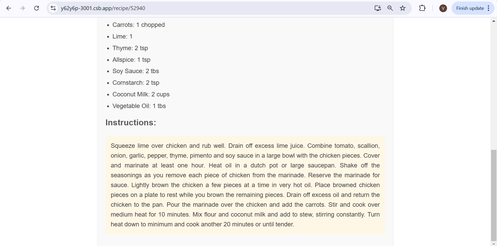

# Getting Started with Create React App

This project was bootstrapped with [Create React App](https://github.com/facebook/create-react-app).

## Available Scripts

In the project directory, you can run:

### `npm install`

Install all the required dependencies like "react-redux, react-router-dom, reduxtoolkit, axios."

### `npm start`

The page will reload when you make changes.\
You may also see any lint errors in the console.

HOME PAGE

SEARCH PAGE

RECIPE LIST

RECIPE DETAILS

RECIPE DESCRIPTION 

